# FantasyEarthZero-npc

FantasyEarthZero npc data

NPCモデル **3種 / 53モデル** を収録しています。各モデルは Blender 用 (`Blender/*.blend`) と元データ (`Model/*.mdl`, `*.tex`, `*.ans`) があります。

> プレビュー画像は各 .blend を Blender 5.2 (EEVEE) で自動レンダリングしたものです（正面やや右上から、アニメーション初期フレームのポーズ）。
> 情報欄はレンダリング時点の値です。

## 一覧

| 種類 | 数 | サムネイル |
|---|:---:|:---:|
| [basic](#basic) | 17 | 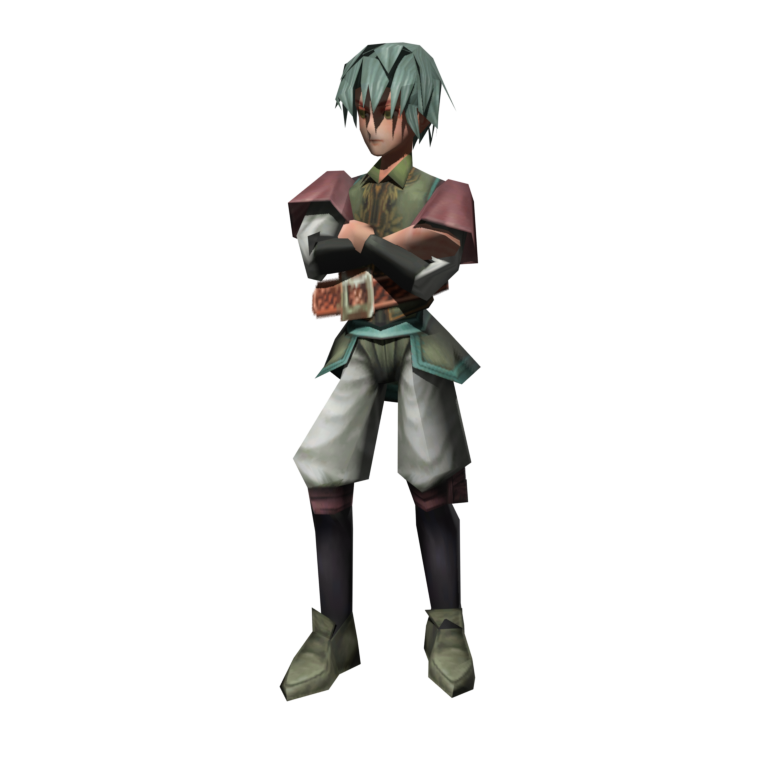 |
| [supporter](#supporter) | 20 | 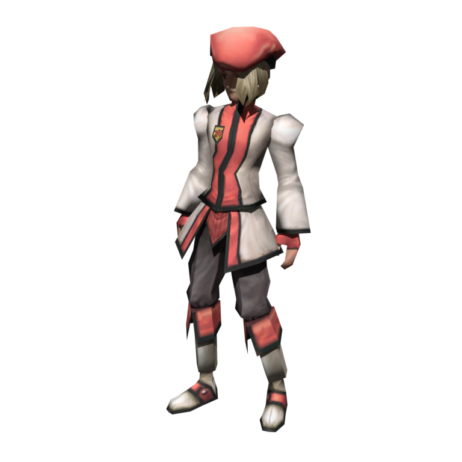 |
| [trainer](#trainer) | 16 | 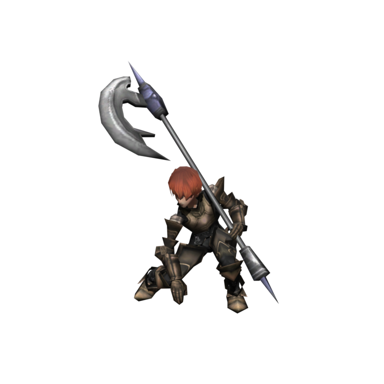 |

## basic

※ basic は Npc00〜Npc16 のみ掲載しています。

| プレビュー | モデル | 情報 |
|:---:|---|---|
|  | **Npc00** [Blender](basic/Blender/Npc00.blend) / [mdl](basic/Model/Npc00.mdl) / [tex](basic/Model/Npc00.tex) / [ans](basic/Model/Npc00.ans) | 頂点 952 / 三角形 914 メッシュ 13 / ボーン 34 アクション 4 テクスチャ 7枚 |
| 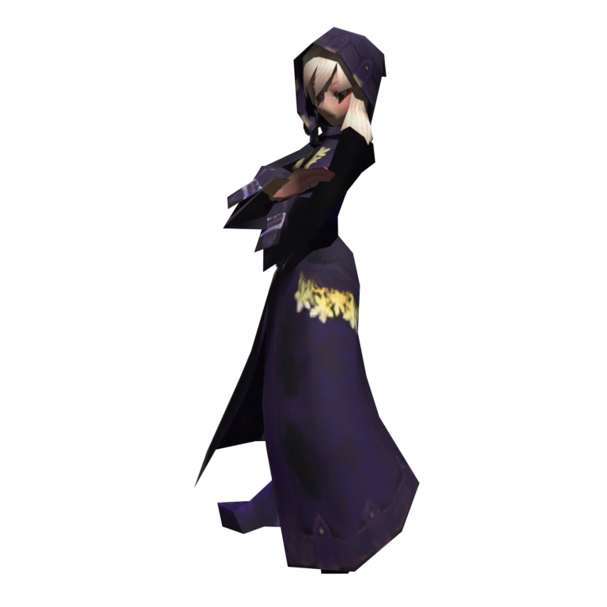 | **Npc01** [Blender](basic/Blender/Npc01.blend) / [mdl](basic/Model/Npc01.mdl) / [tex](basic/Model/Npc01.tex) / [ans](basic/Model/Npc01.ans) | 頂点 878 / 三角形 940 メッシュ 13 / ボーン 36 アクション 4 テクスチャ 8枚 |
| 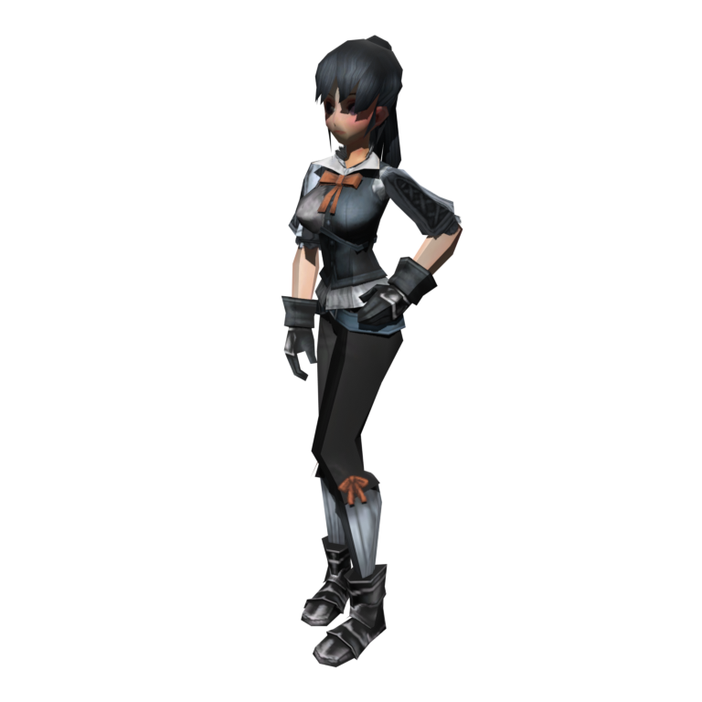 | **Npc02** [Blender](basic/Blender/Npc02.blend) / [mdl](basic/Model/Npc02.mdl) / [tex](basic/Model/Npc02.tex) / [ans](basic/Model/Npc02.ans) | 頂点 1495 / 三角形 1401 メッシュ 11 / ボーン 36 アクション 4 テクスチャ 7枚 |
| 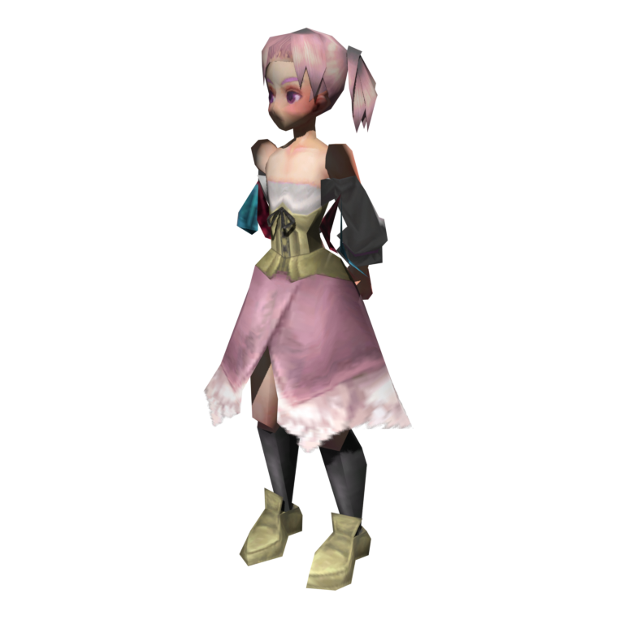 | **Npc03** [Blender](basic/Blender/Npc03.blend) / [mdl](basic/Model/Npc03.mdl) / [tex](basic/Model/Npc03.tex) / [ans](basic/Model/Npc03.ans) | 頂点 1011 / 三角形 1042 メッシュ 11 / ボーン 35 アクション 4 テクスチャ 7枚 |
| 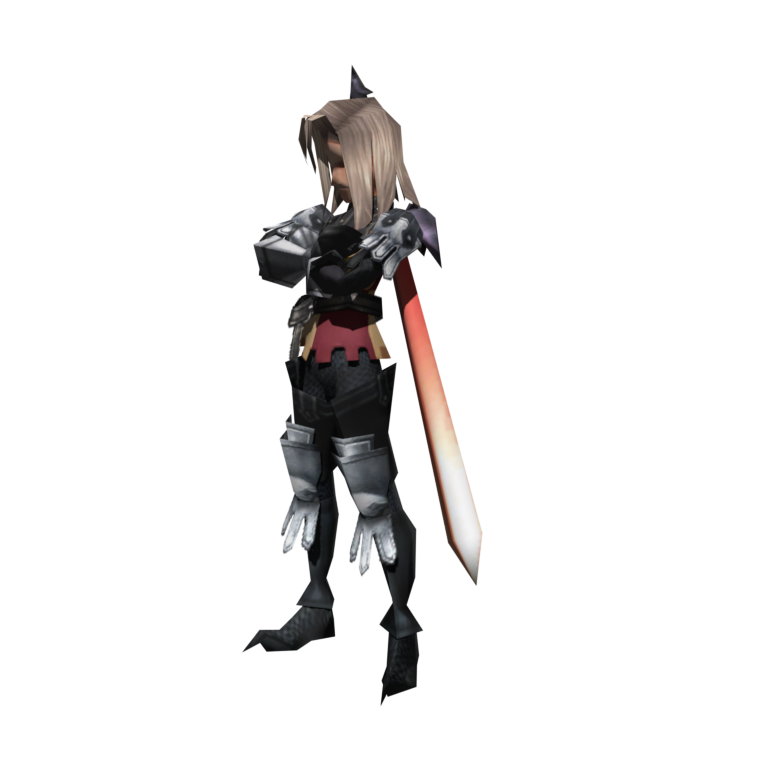 | **Npc04** [Blender](basic/Blender/Npc04.blend) / [mdl](basic/Model/Npc04.mdl) / [tex](basic/Model/Npc04.tex) / [ans](basic/Model/Npc04.ans) | 頂点 1164 / 三角形 1149 メッシュ 16 / ボーン 34 アクション 4 テクスチャ 8枚 |
| 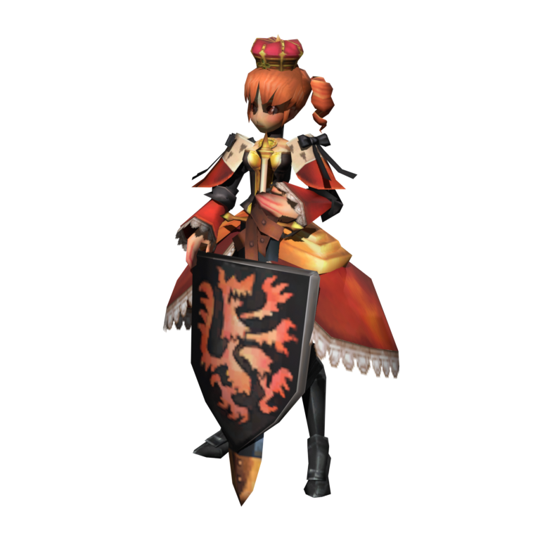 | **Npc05** [Blender](basic/Blender/Npc05.blend) / [mdl](basic/Model/Npc05.mdl) / [tex](basic/Model/Npc05.tex) / [ans](basic/Model/Npc05.ans) | 頂点 1719 / 三角形 1993 メッシュ 21 / ボーン 44 アクション 4 テクスチャ 9枚 |
| 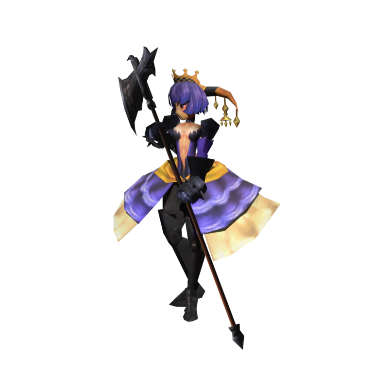 | **Npc06** [Blender](basic/Blender/Npc06.blend) / [mdl](basic/Model/Npc06.mdl) / [tex](basic/Model/Npc06.tex) / [ans](basic/Model/Npc06.ans) | 頂点 1842 / 三角形 1831 メッシュ 20 / ボーン 52 アクション 4 テクスチャ 8枚 |
| 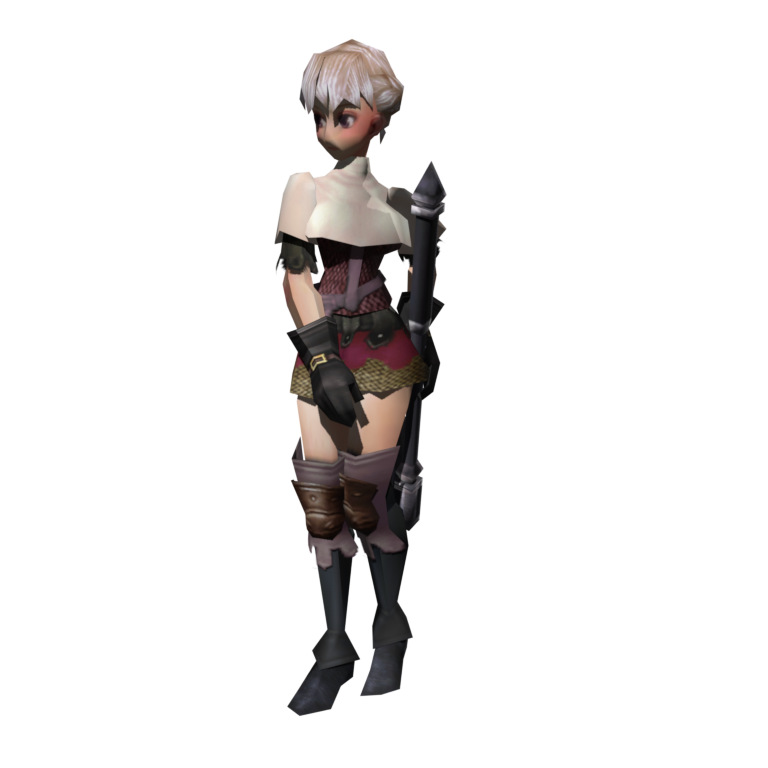 | **Npc07** [Blender](basic/Blender/Npc07.blend) / [mdl](basic/Model/Npc07.mdl) / [tex](basic/Model/Npc07.tex) / [ans](basic/Model/Npc07.ans) | 頂点 1275 / 三角形 1255 メッシュ 18 / ボーン 36 アクション 4 テクスチャ 8枚 |
|  | **Npc08** [Blender](basic/Blender/Npc08.blend) / [mdl](basic/Model/Npc08.mdl) / [tex](basic/Model/Npc08.tex) / [ans](basic/Model/Npc08.ans) | 頂点 1012 / 三角形 1107 メッシュ 16 / ボーン 39 アクション 4 テクスチャ 8枚 |
| 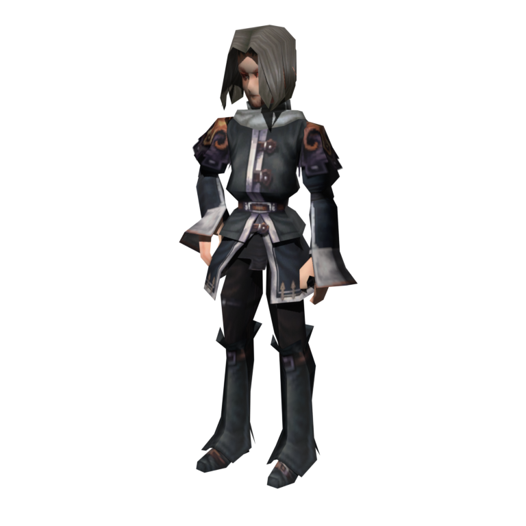 | **Npc09** [Blender](basic/Blender/Npc09.blend) / [mdl](basic/Model/Npc09.mdl) / [tex](basic/Model/Npc09.tex) / [ans](basic/Model/Npc09.ans) | 頂点 1174 / 三角形 1167 メッシュ 8 / ボーン 32 アクション 4 テクスチャ 7枚 |
| 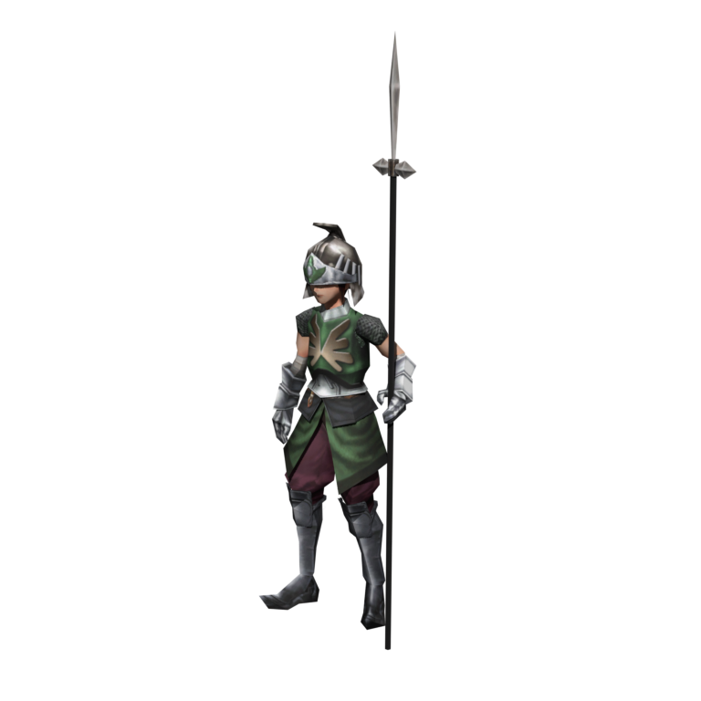 | **Npc10** [Blender](basic/Blender/Npc10.blend) / [mdl](basic/Model/Npc10.mdl) / [tex](basic/Model/Npc10.tex) / [ans](basic/Model/Npc10.ans) | 頂点 1312 / 三角形 1159 メッシュ 15 / ボーン 40 アクション 4 テクスチャ 2枚 |
| 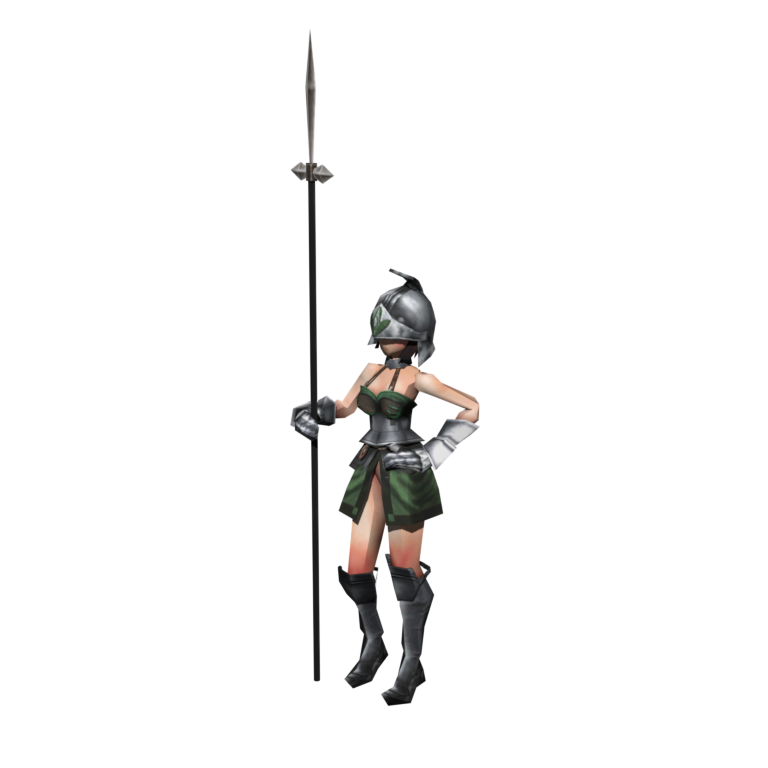 | **Npc11** [Blender](basic/Blender/Npc11.blend) / [mdl](basic/Model/Npc11.mdl) / [tex](basic/Model/Npc11.tex) / [ans](basic/Model/Npc11.ans) | 頂点 1349 / 三角形 1230 メッシュ 20 / ボーン 44 アクション 4 テクスチャ 2枚 |
| 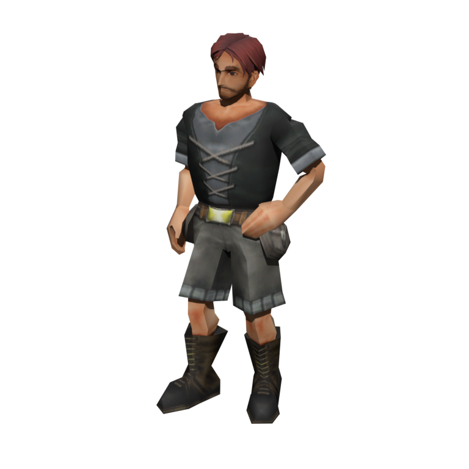 | **Npc12** [Blender](basic/Blender/Npc12.blend) / [mdl](basic/Model/Npc12.mdl) / [tex](basic/Model/Npc12.tex) / [ans](basic/Model/Npc12.ans) | 頂点 1236 / 三角形 1188 メッシュ 13 / ボーン 38 アクション 4 テクスチャ 2枚 |
| 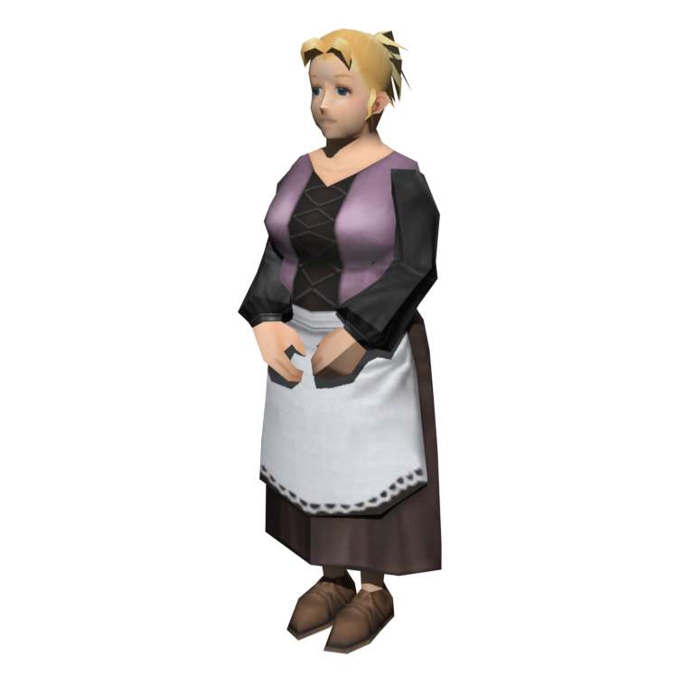 | **Npc13** [Blender](basic/Blender/Npc13.blend) / [mdl](basic/Model/Npc13.mdl) / [tex](basic/Model/Npc13.tex) / [ans](basic/Model/Npc13.ans) | 頂点 878 / 三角形 966 メッシュ 13 / ボーン 37 アクション 4 テクスチャ 2枚 |
| 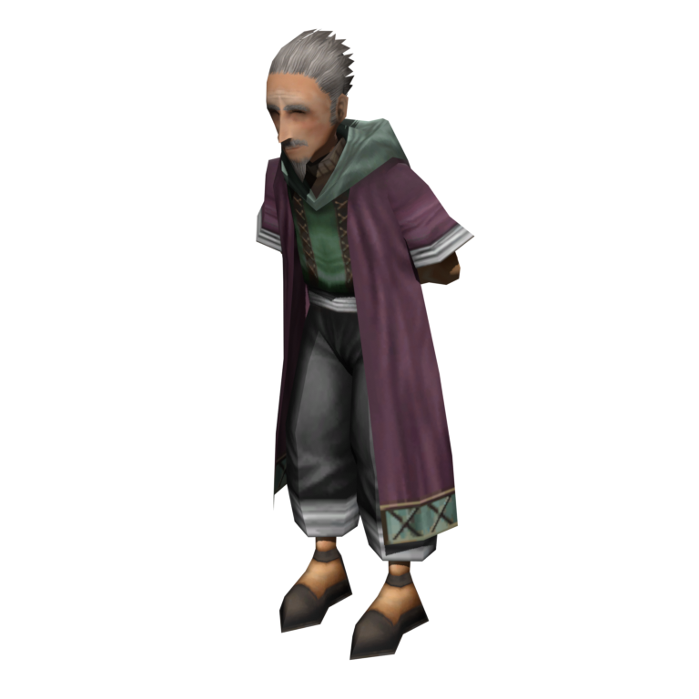 | **Npc14** [Blender](basic/Blender/Npc14.blend) / [mdl](basic/Model/Npc14.mdl) / [tex](basic/Model/Npc14.tex) / [ans](basic/Model/Npc14.ans) | 頂点 1114 / 三角形 1071 メッシュ 10 / ボーン 35 アクション 4 テクスチャ 2枚 |
| 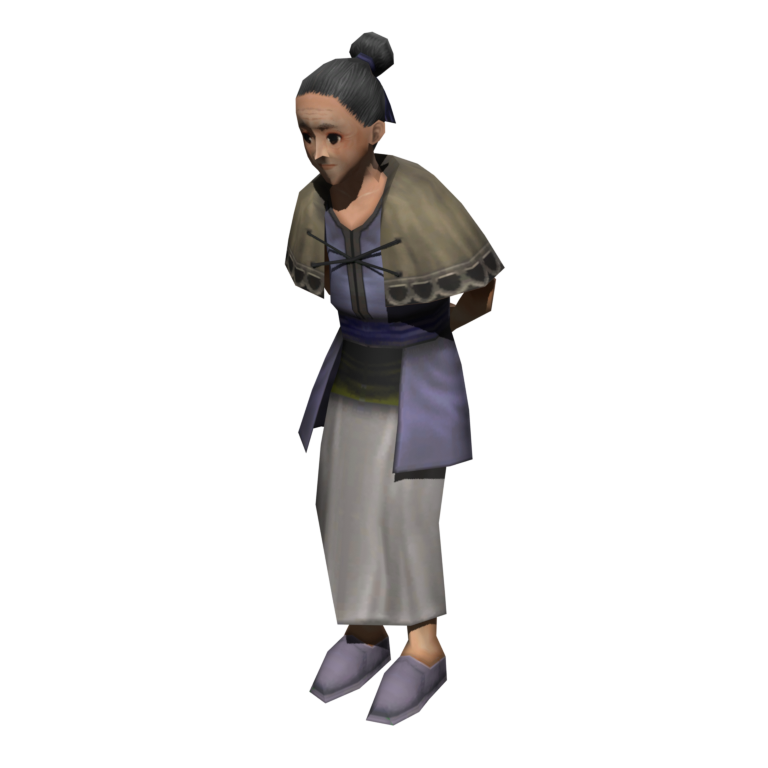 | **Npc15** [Blender](basic/Blender/Npc15.blend) / [mdl](basic/Model/Npc15.mdl) / [tex](basic/Model/Npc15.tex) / [ans](basic/Model/Npc15.ans) | 頂点 908 / 三角形 1032 メッシュ 13 / ボーン 33 アクション 4 テクスチャ 2枚 |
| 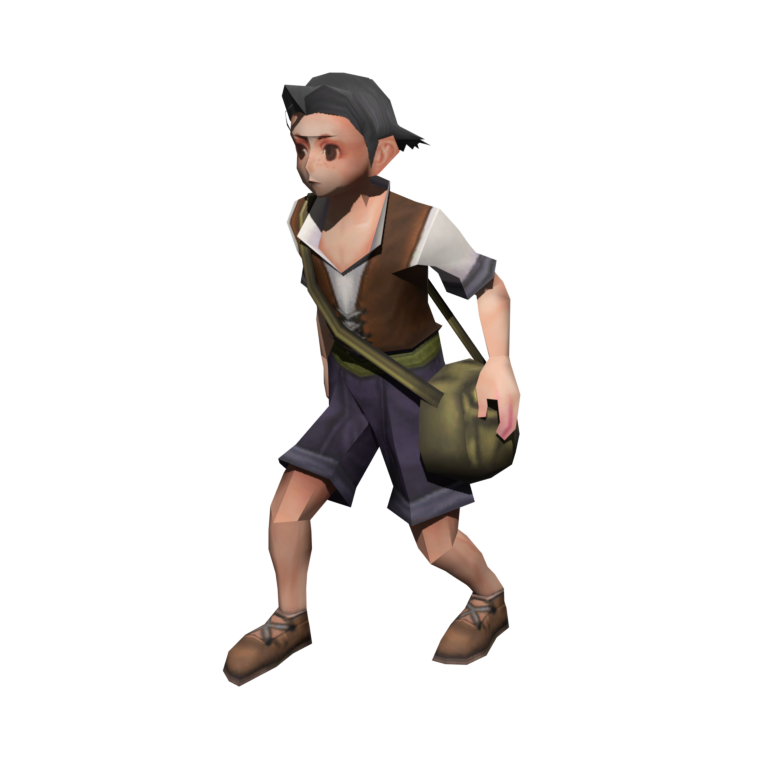 | **Npc16** [Blender](basic/Blender/Npc16.blend) / [mdl](basic/Model/Npc16.mdl) / [tex](basic/Model/Npc16.tex) / [ans](basic/Model/Npc16.ans) | 頂点 1165 / 三角形 1165 メッシュ 13 / ボーン 31 アクション 4 テクスチャ 2枚 |

## supporter

| プレビュー | モデル | 情報 |
|:---:|---|---|
|  | **vnpc_m_100** [Blender](supporter/Blender/vnpc_m_100.blend) / [mdl](supporter/Model/vnpc_m_100.mdl) / [tex](supporter/Model/vnpc_m_100.tex) / [ans](supporter/Model/vnpc_m_100.ans) | 頂点 1138 / 三角形 1115 メッシュ 11 / ボーン 35 アクション 4 テクスチャ 8枚 |
| 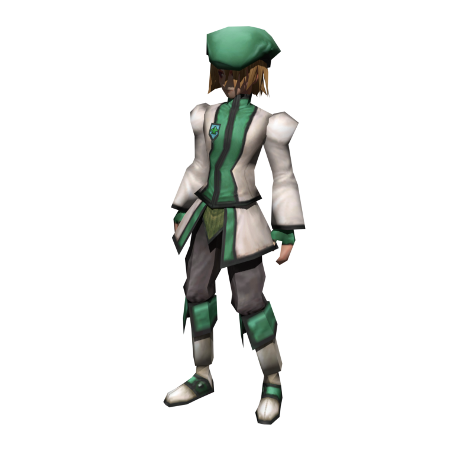 | **vnpc_m_101** [Blender](supporter/Blender/vnpc_m_101.blend) / [mdl](supporter/Model/vnpc_m_101.mdl) / [tex](supporter/Model/vnpc_m_101.tex) / [ans](supporter/Model/vnpc_m_101.ans) | 頂点 1220 / 三角形 1174 メッシュ 11 / ボーン 35 アクション 4 テクスチャ 8枚 |
| 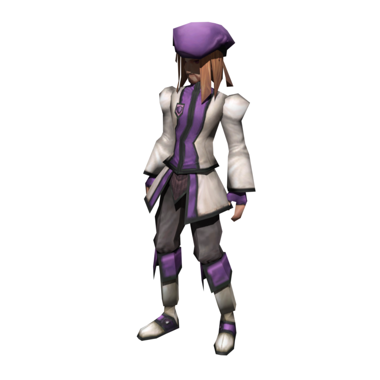 | **vnpc_m_102** [Blender](supporter/Blender/vnpc_m_102.blend) / [mdl](supporter/Model/vnpc_m_102.mdl) / [tex](supporter/Model/vnpc_m_102.tex) / [ans](supporter/Model/vnpc_m_102.ans) | 頂点 1131 / 三角形 1106 メッシュ 11 / ボーン 35 アクション 4 テクスチャ 8枚 |
| 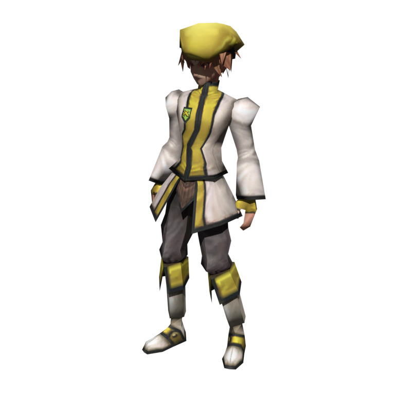 | **vnpc_m_103** [Blender](supporter/Blender/vnpc_m_103.blend) / [mdl](supporter/Model/vnpc_m_103.mdl) / [tex](supporter/Model/vnpc_m_103.tex) / [ans](supporter/Model/vnpc_m_103.ans) | 頂点 1231 / 三角形 1153 メッシュ 11 / ボーン 35 アクション 4 テクスチャ 8枚 |
| 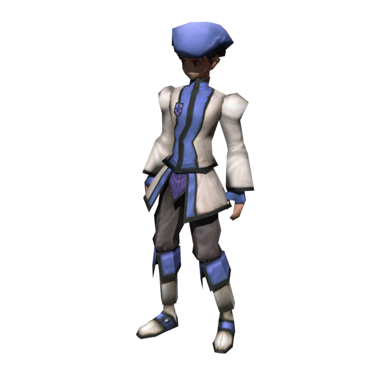 | **vnpc_m_104** [Blender](supporter/Blender/vnpc_m_104.blend) / [mdl](supporter/Model/vnpc_m_104.mdl) / [tex](supporter/Model/vnpc_m_104.tex) / [ans](supporter/Model/vnpc_m_104.ans) | 頂点 1196 / 三角形 1143 メッシュ 11 / ボーン 35 アクション 4 テクスチャ 8枚 |
| 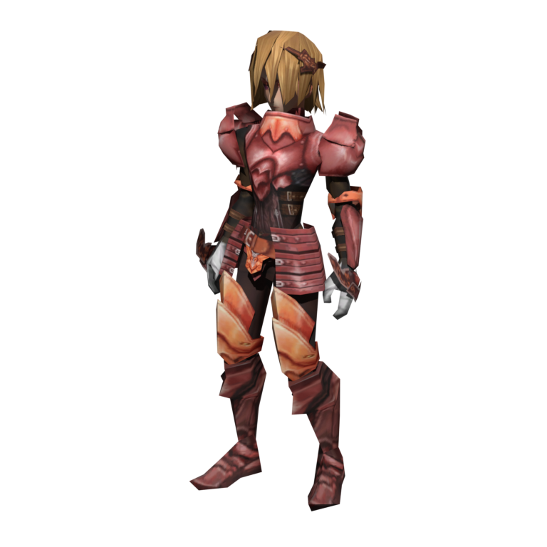 | **vnpc_m_105** [Blender](supporter/Blender/vnpc_m_105.blend) / [mdl](supporter/Model/vnpc_m_105.mdl) / [tex](supporter/Model/vnpc_m_105.tex) / [ans](supporter/Model/vnpc_m_105.ans) | 頂点 1516 / 三角形 1383 メッシュ 14 / ボーン 37 アクション 4 テクスチャ 8枚 |
| 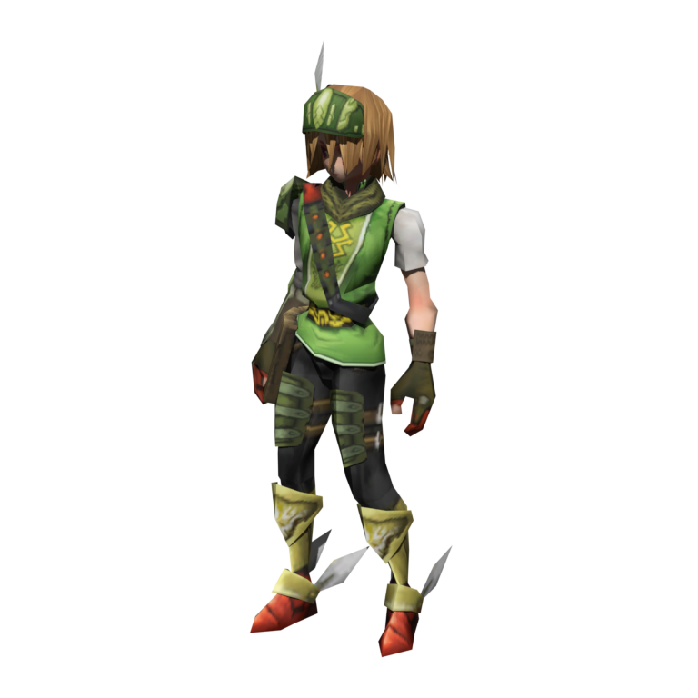 | **vnpc_m_106** [Blender](supporter/Blender/vnpc_m_106.blend) / [mdl](supporter/Model/vnpc_m_106.mdl) / [tex](supporter/Model/vnpc_m_106.tex) / [ans](supporter/Model/vnpc_m_106.ans) | 頂点 1377 / 三角形 1180 メッシュ 13 / ボーン 37 アクション 4 テクスチャ 8枚 |
| 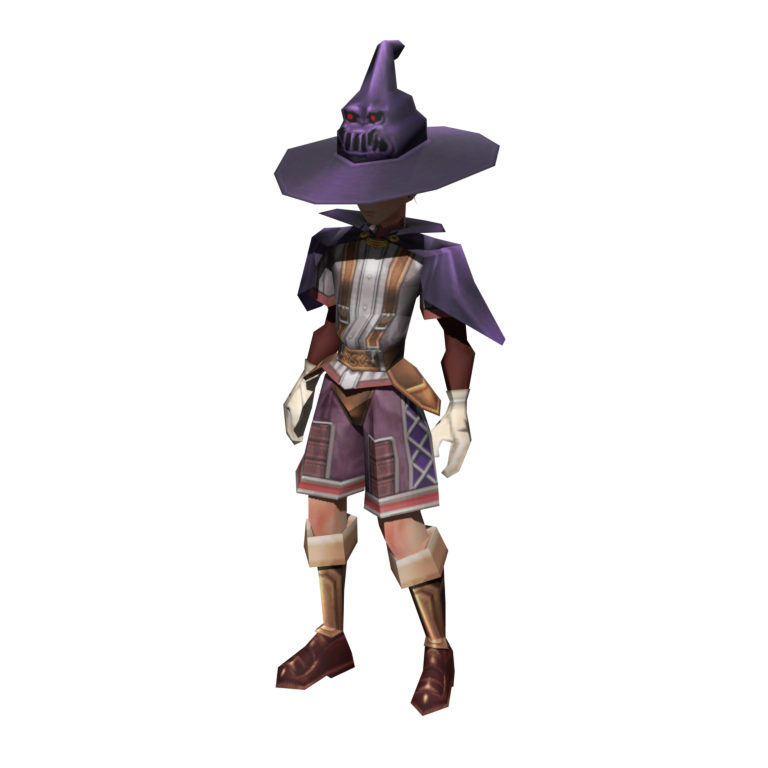 | **vnpc_m_107** [Blender](supporter/Blender/vnpc_m_107.blend) / [mdl](supporter/Model/vnpc_m_107.mdl) / [tex](supporter/Model/vnpc_m_107.tex) / [ans](supporter/Model/vnpc_m_107.ans) | 頂点 1554 / 三角形 1214 メッシュ 16 / ボーン 41 アクション 4 テクスチャ 8枚 |
| 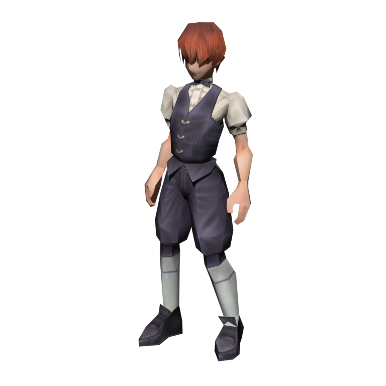 | **vnpc_m_110** [Blender](supporter/Blender/vnpc_m_110.blend) / [mdl](supporter/Model/vnpc_m_110.mdl) / [tex](supporter/Model/vnpc_m_110.tex) / [ans](supporter/Model/vnpc_m_110.ans) | 頂点 1397 / 三角形 1110 メッシュ 13 / ボーン 37 アクション 4 テクスチャ 8枚 |
| 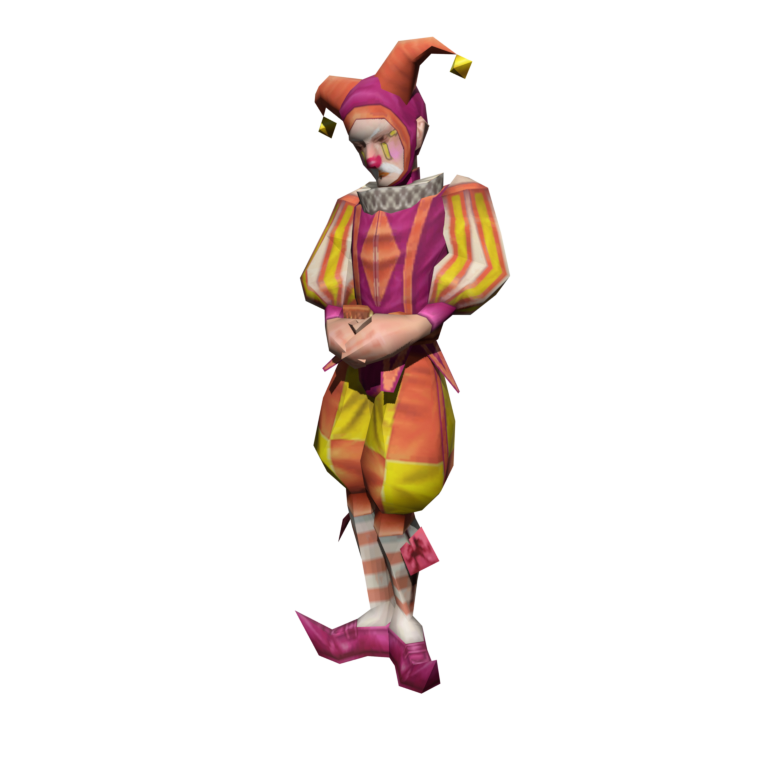 | **vnpc_m_120** [Blender](supporter/Blender/vnpc_m_120.blend) / [mdl](supporter/Model/vnpc_m_120.mdl) / [tex](supporter/Model/vnpc_m_120.tex) / [ans](supporter/Model/vnpc_m_120.ans) | 頂点 1148 / 三角形 957 メッシュ 12 / ボーン 36 アクション 4 テクスチャ 7枚 |
|  | **vnpc_w_100** [Blender](supporter/Blender/vnpc_w_100.blend) / [mdl](supporter/Model/vnpc_w_100.mdl) / [tex](supporter/Model/vnpc_w_100.tex) / [ans](supporter/Model/vnpc_w_100.ans) | 頂点 1378 / 三角形 1267 メッシュ 10 / ボーン 36 アクション 4 テクスチャ 8枚 |
| 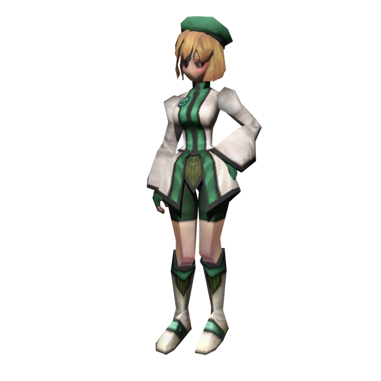 | **vnpc_w_101** [Blender](supporter/Blender/vnpc_w_101.blend) / [mdl](supporter/Model/vnpc_w_101.mdl) / [tex](supporter/Model/vnpc_w_101.tex) / [ans](supporter/Model/vnpc_w_101.ans) | 頂点 1193 / 三角形 1124 メッシュ 10 / ボーン 36 アクション 4 テクスチャ 8枚 |
| 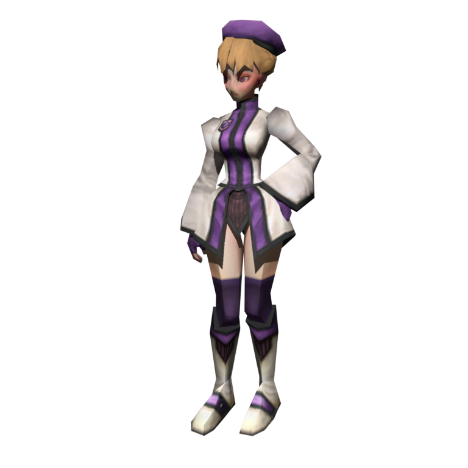 | **vnpc_w_102** [Blender](supporter/Blender/vnpc_w_102.blend) / [mdl](supporter/Model/vnpc_w_102.mdl) / [tex](supporter/Model/vnpc_w_102.tex) / [ans](supporter/Model/vnpc_w_102.ans) | 頂点 1222 / 三角形 1177 メッシュ 10 / ボーン 36 アクション 4 テクスチャ 8枚 |
| 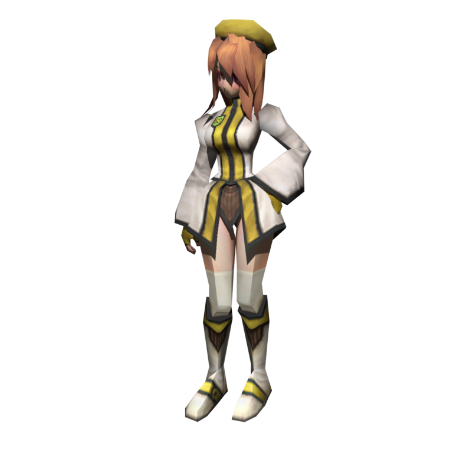 | **vnpc_w_103** [Blender](supporter/Blender/vnpc_w_103.blend) / [mdl](supporter/Model/vnpc_w_103.mdl) / [tex](supporter/Model/vnpc_w_103.tex) / [ans](supporter/Model/vnpc_w_103.ans) | 頂点 1188 / 三角形 1131 メッシュ 10 / ボーン 36 アクション 4 テクスチャ 8枚 |
| 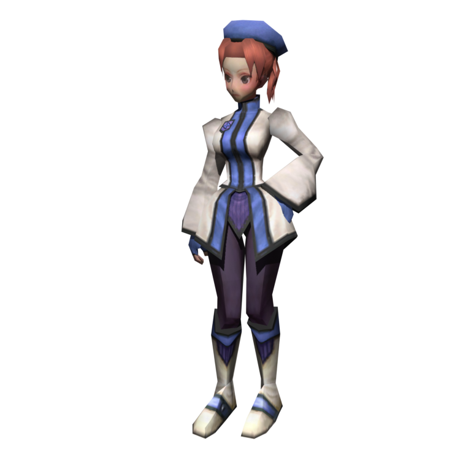 | **vnpc_w_104** [Blender](supporter/Blender/vnpc_w_104.blend) / [mdl](supporter/Model/vnpc_w_104.mdl) / [tex](supporter/Model/vnpc_w_104.tex) / [ans](supporter/Model/vnpc_w_104.ans) | 頂点 1235 / 三角形 1162 メッシュ 11 / ボーン 37 アクション 4 テクスチャ 8枚 |
| 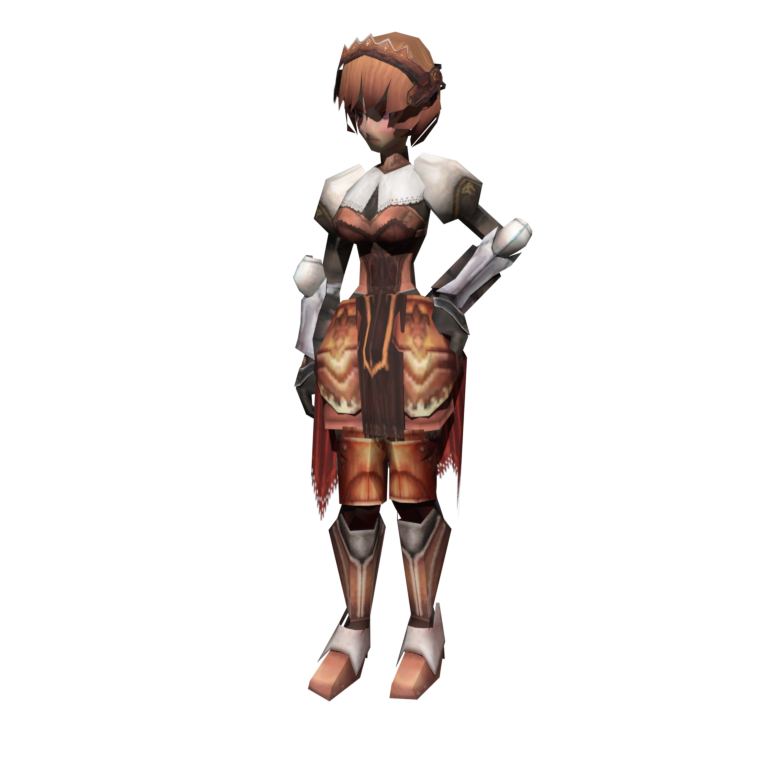 | **vnpc_w_105** [Blender](supporter/Blender/vnpc_w_105.blend) / [mdl](supporter/Model/vnpc_w_105.mdl) / [tex](supporter/Model/vnpc_w_105.tex) / [ans](supporter/Model/vnpc_w_105.ans) | 頂点 1589 / 三角形 1316 メッシュ 15 / ボーン 41 アクション 4 テクスチャ 8枚 |
| 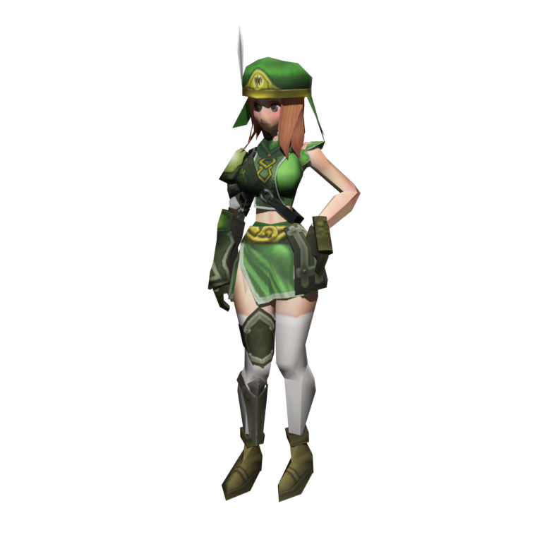 | **vnpc_w_106** [Blender](supporter/Blender/vnpc_w_106.blend) / [mdl](supporter/Model/vnpc_w_106.mdl) / [tex](supporter/Model/vnpc_w_106.tex) / [ans](supporter/Model/vnpc_w_106.ans) | 頂点 1578 / 三角形 1385 メッシュ 20 / ボーン 46 アクション 4 テクスチャ 8枚 |
| 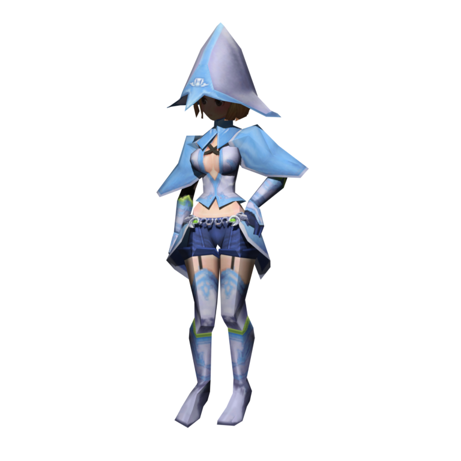 | **vnpc_w_107** [Blender](supporter/Blender/vnpc_w_107.blend) / [mdl](supporter/Model/vnpc_w_107.mdl) / [tex](supporter/Model/vnpc_w_107.tex) / [ans](supporter/Model/vnpc_w_107.ans) | 頂点 1476 / 三角形 1197 メッシュ 13 / ボーン 40 アクション 4 テクスチャ 8枚 |
| 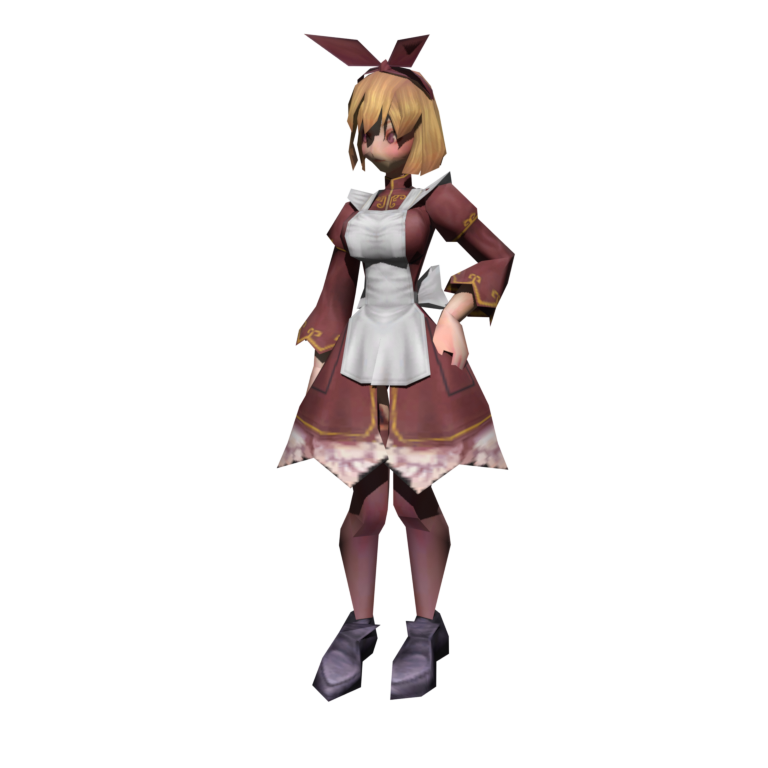 | **vnpc_w_110** [Blender](supporter/Blender/vnpc_w_110.blend) / [mdl](supporter/Model/vnpc_w_110.mdl) / [tex](supporter/Model/vnpc_w_110.tex) / [ans](supporter/Model/vnpc_w_110.ans) | 頂点 1341 / 三角形 1140 メッシュ 17 / ボーン 42 アクション 4 テクスチャ 8枚 |
| 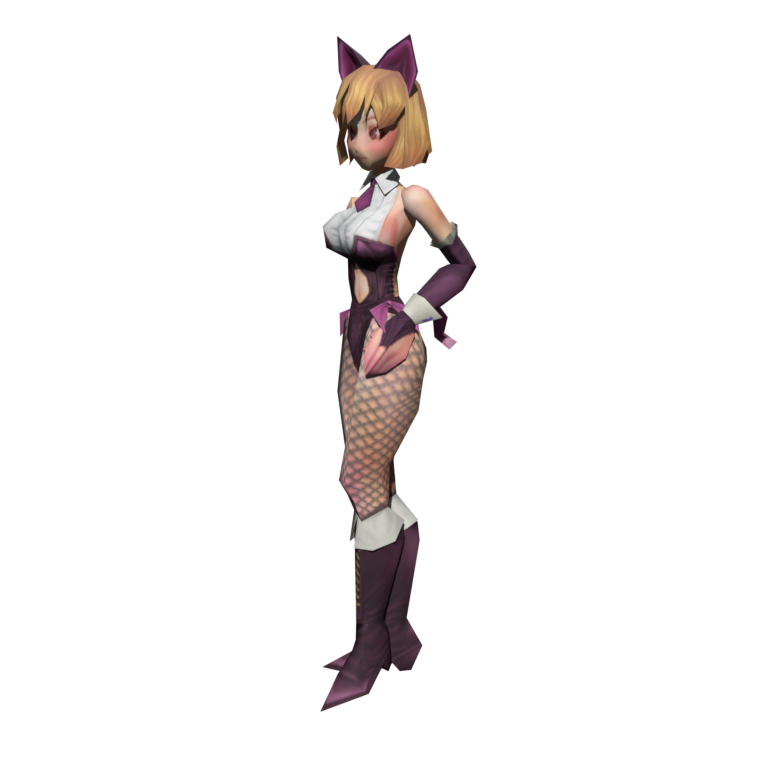 | **vnpc_w_120** [Blender](supporter/Blender/vnpc_w_120.blend) / [mdl](supporter/Model/vnpc_w_120.mdl) / [tex](supporter/Model/vnpc_w_120.tex) / [ans](supporter/Model/vnpc_w_120.ans) | 頂点 1182 / 三角形 1049 メッシュ 14 / ボーン 39 アクション 4 テクスチャ 8枚 |

## trainer

| プレビュー | モデル | 情報 |
|:---:|---|---|
|  | **Npc_tr_00_m** [Blender](trainer/Blender/Npc_tr_00_m.blend) / [mdl](trainer/Model/Npc_tr_00_m.mdl) / [tex](trainer/Model/Npc_tr_00_m.tex) / [ans](trainer/Model/Npc_tr_00_m.ans) | 頂点 1370 / 三角形 1325 メッシュ 11 / ボーン 33 アクション 2 テクスチャ 8枚 |
| 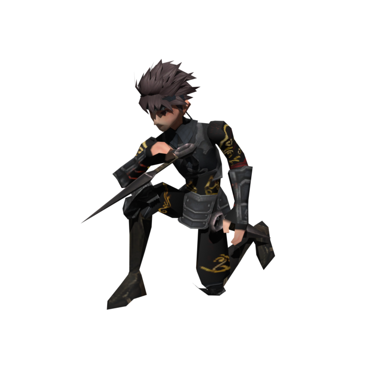 | **Npc_tr_01_m** [Blender](trainer/Blender/Npc_tr_01_m.blend) / [mdl](trainer/Model/Npc_tr_01_m.mdl) / [tex](trainer/Model/Npc_tr_01_m.tex) / [ans](trainer/Model/Npc_tr_01_m.ans) | 頂点 1289 / 三角形 1143 メッシュ 11 / ボーン 36 アクション 2 テクスチャ 9枚 |
| 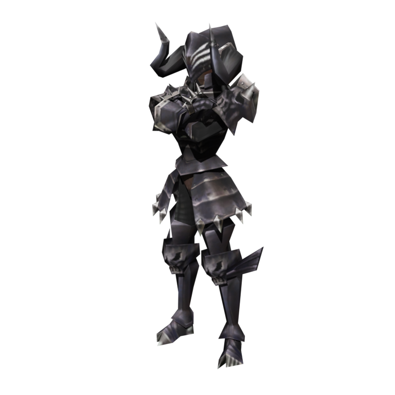 | **Npc_tr_02_m** [Blender](trainer/Blender/Npc_tr_02_m.blend) / [mdl](trainer/Model/Npc_tr_02_m.mdl) / [tex](trainer/Model/Npc_tr_02_m.tex) / [ans](trainer/Model/Npc_tr_02_m.ans) | 頂点 1625 / 三角形 1456 メッシュ 11 / ボーン 37 アクション 2 テクスチャ 7枚 |
| 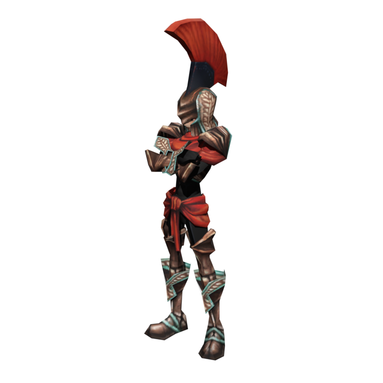 | **Npc_tr_03_m** [Blender](trainer/Blender/Npc_tr_03_m.blend) / [mdl](trainer/Model/Npc_tr_03_m.mdl) / [tex](trainer/Model/Npc_tr_03_m.tex) / [ans](trainer/Model/Npc_tr_03_m.ans) | 頂点 1478 / 三角形 1464 メッシュ 16 / ボーン 35 アクション 2 テクスチャ 7枚 |
| 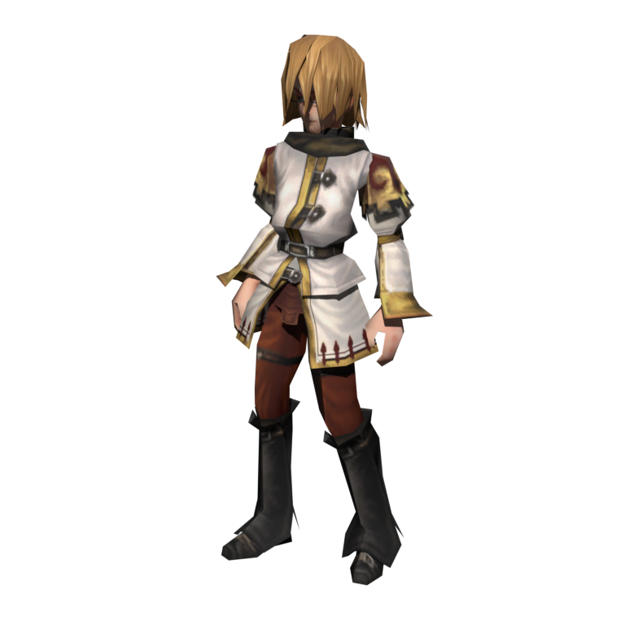 | **Npc_tr_04_m** [Blender](trainer/Blender/Npc_tr_04_m.blend) / [mdl](trainer/Model/Npc_tr_04_m.mdl) / [tex](trainer/Model/Npc_tr_04_m.tex) / [ans](trainer/Model/Npc_tr_04_m.ans) | 頂点 1317 / 三角形 1265 メッシュ 12 / ボーン 33 アクション 2 テクスチャ 8枚 |
|  | **Npc_tr_05_w** [Blender](trainer/Blender/Npc_tr_05_w.blend) / [mdl](trainer/Model/Npc_tr_05_w.mdl) / [tex](trainer/Model/Npc_tr_05_w.tex) / [ans](trainer/Model/Npc_tr_05_w.ans) | 頂点 1454 / 三角形 1339 メッシュ 16 / ボーン 41 アクション 2 テクスチャ 9枚 |
| 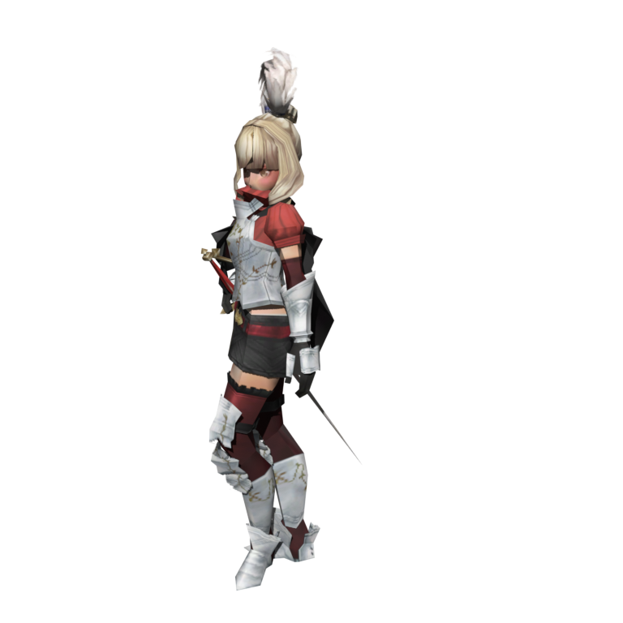 | **Npc_tr_06_w** [Blender](trainer/Blender/Npc_tr_06_w.blend) / [mdl](trainer/Model/Npc_tr_06_w.mdl) / [tex](trainer/Model/Npc_tr_06_w.tex) / [ans](trainer/Model/Npc_tr_06_w.ans) | 頂点 2531 / 三角形 2131 メッシュ 25 / ボーン 47 アクション 2 テクスチャ 10枚 |
| 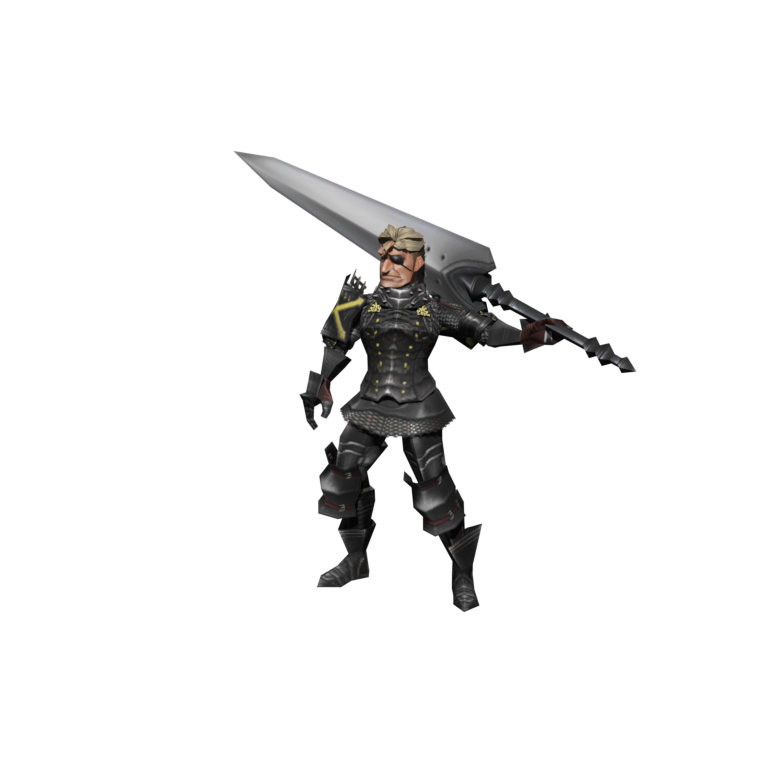 | **Npc_tr_07_m** [Blender](trainer/Blender/Npc_tr_07_m.blend) / [mdl](trainer/Model/Npc_tr_07_m.mdl) / [tex](trainer/Model/Npc_tr_07_m.tex) / [ans](trainer/Model/Npc_tr_07_m.ans) | 頂点 2096 / 三角形 1752 メッシュ 18 / ボーン 42 アクション 2 テクスチャ 9枚 |
| 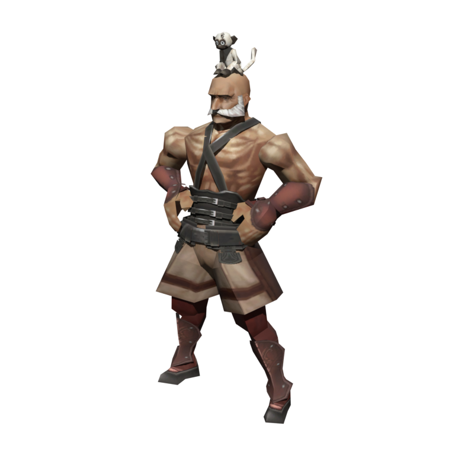 | **Npc_tr_08_m** [Blender](trainer/Blender/Npc_tr_08_m.blend) / [mdl](trainer/Model/Npc_tr_08_m.mdl) / [tex](trainer/Model/Npc_tr_08_m.tex) / [ans](trainer/Model/Npc_tr_08_m.ans) | 頂点 1898 / 三角形 1668 メッシュ 17 / ボーン 61 アクション 2 テクスチャ 9枚 |
| 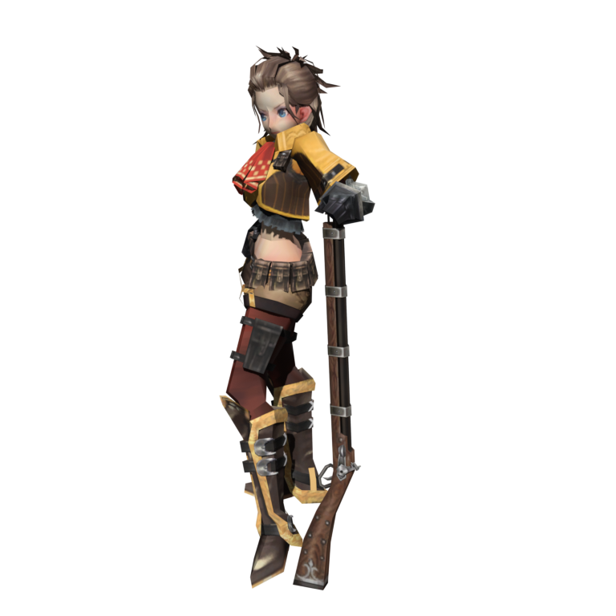 | **Npc_tr_09_w** [Blender](trainer/Blender/Npc_tr_09_w.blend) / [mdl](trainer/Model/Npc_tr_09_w.mdl) / [tex](trainer/Model/Npc_tr_09_w.tex) / [ans](trainer/Model/Npc_tr_09_w.ans) | 頂点 3170 / 三角形 2457 メッシュ 17 / ボーン 44 アクション 2 テクスチャ 8枚 |
|  | **Npc_tr_10_w** [Blender](trainer/Blender/Npc_tr_10_w.blend) / [mdl](trainer/Model/Npc_tr_10_w.mdl) / [tex](trainer/Model/Npc_tr_10_w.tex) / [ans](trainer/Model/Npc_tr_10_w.ans) | 頂点 3197 / 三角形 2915 メッシュ 21 / ボーン 46 アクション 2 テクスチャ 9枚 |
|  | **Npc_tr_11_w** [Blender](trainer/Blender/Npc_tr_11_w.blend) / [mdl](trainer/Model/Npc_tr_11_w.mdl) / [tex](trainer/Model/Npc_tr_11_w.tex) / [ans](trainer/Model/Npc_tr_11_w.ans) | 頂点 1519 / 三角形 1432 メッシュ 14 / ボーン 41 アクション 2 テクスチャ 9枚 |
|  | **Npc_tr_12_w** [Blender](trainer/Blender/Npc_tr_12_w.blend) / [mdl](trainer/Model/Npc_tr_12_w.mdl) / [tex](trainer/Model/Npc_tr_12_w.tex) / [ans](trainer/Model/Npc_tr_12_w.ans) | 頂点 1282 / 三角形 1225 メッシュ 14 / ボーン 38 アクション 2 テクスチャ 8枚 |
| 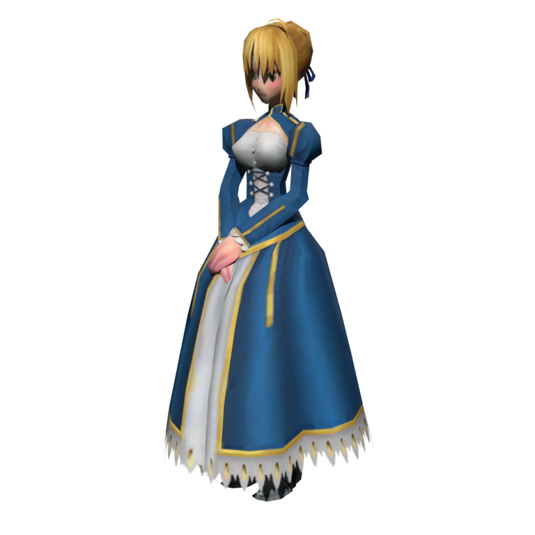 | **Npc_tr_13_w** [Blender](trainer/Blender/Npc_tr_13_w.blend) / [mdl](trainer/Model/Npc_tr_13_w.mdl) / [tex](trainer/Model/Npc_tr_13_w.tex) / [ans](trainer/Model/Npc_tr_13_w.ans) | 頂点 2000 / 三角形 1866 メッシュ 10 / ボーン 37 アクション 2 テクスチャ 7枚 |
| 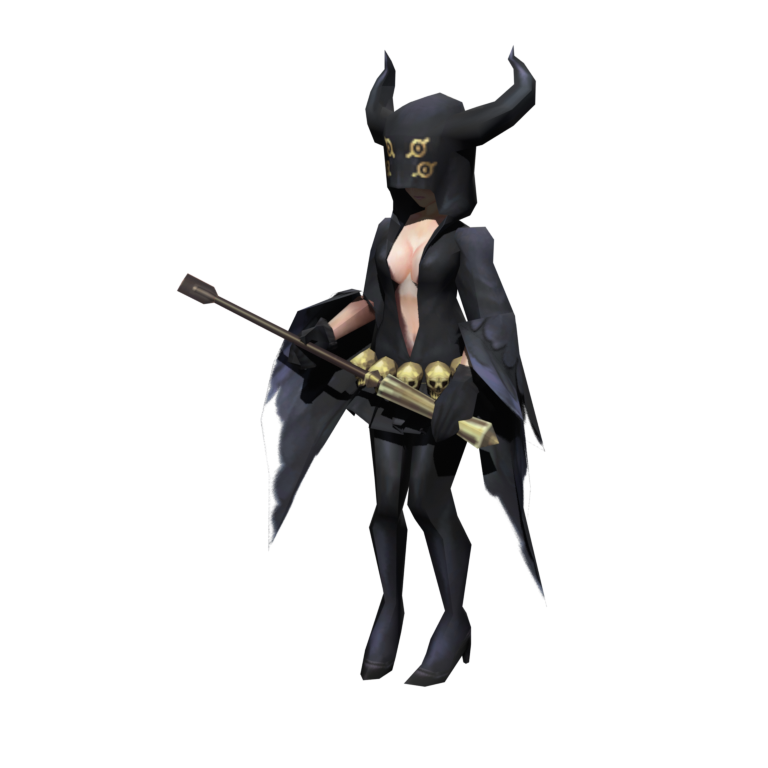 | **Npc_tr_14_w** [Blender](trainer/Blender/Npc_tr_14_w.blend) / [mdl](trainer/Model/Npc_tr_14_w.mdl) / [tex](trainer/Model/Npc_tr_14_w.tex) / [ans](trainer/Model/Npc_tr_14_w.ans) | 頂点 1927 / 三角形 1814 メッシュ 7 / ボーン 34 アクション 2 テクスチャ 1枚 |
| 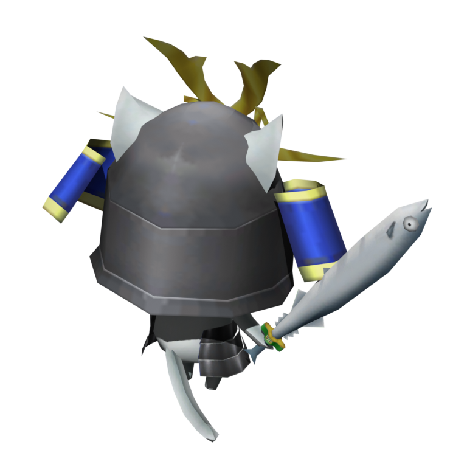 | **Npc_tr_15_x** [Blender](trainer/Blender/Npc_tr_15_x.blend) / [mdl](trainer/Model/Npc_tr_15_x.mdl) / [tex](trainer/Model/Npc_tr_15_x.tex) | 頂点 1247 / 三角形 1429 メッシュ 7 / ボーン 9 アクション 0 テクスチャ 1枚 |
